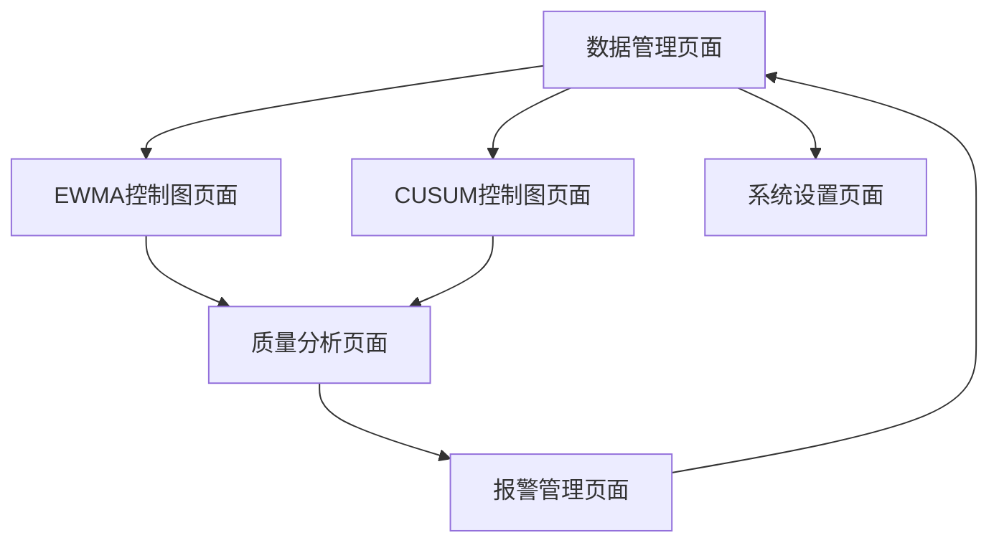

# SPC成纸质量管理系统产品需求文档

## 1. 产品概述

本系统是一个基于统计过程控制（SPC）的成纸质量管理系统，专注于造纸行业的质量监控和分析。
系统采用EWMA（指数加权移动平均）和CUSUM（累积和控制图）方法进行质量数据分析，帮助企业实时监控生产过程，及时发现质量异常，提升产品质量稳定性。
该系统将为造纸企业提供科学的质量管理工具，降低质量风险，提高生产效率和产品竞争力。

## 2. 核心功能

### 2.1 用户角色

| 角色 | 注册方式 | 核心权限 |
|------|----------|----------|
| 质量工程师 | 系统管理员分配账号 | 数据录入、图表查看、报告生成、参数设置 |
| 生产主管 | 系统管理员分配账号 | 查看控制图、异常报警、趋势分析 |
| 系统管理员 | 默认超级用户 | 用户管理、系统配置、数据备份 |

### 2.2 功能模块

本SPC成纸质量管理系统包含以下主要页面：
1. **数据管理页面**：数据导入、数据预处理、历史数据查询
2. **EWMA控制图页面**：EWMA图表生成、参数配置、异常检测
3. **CUSUM控制图页面**：CUSUM图表生成、参数设置、趋势分析
4. **质量分析页面**：综合分析报告、统计指标计算、质量评估
5. **报警管理页面**：异常报警设置、报警历史、通知管理
6. **系统设置页面**：用户管理、参数配置、系统维护

### 2.3 页面详情

| 页面名称 | 模块名称 | 功能描述 |
|----------|----------|----------|
| 数据管理页面 | 数据导入模块 | 支持Excel文件导入，数据格式验证，批量数据处理 |
| 数据管理页面 | 数据预处理模块 | 数据清洗，异常值处理，数据标准化 |
| 数据管理页面 | 历史数据查询 | 按时间范围查询，数据筛选，导出功能 |
| EWMA控制图页面 | 图表生成模块 | 实时生成EWMA控制图，支持多指标同时显示 |
| EWMA控制图页面 | 参数配置模块 | 设置λ参数，控制限计算，目标值设定 |
| EWMA控制图页面 | 异常检测模块 | 自动识别超限点，异常模式识别，预警提示 |
| CUSUM控制图页面 | 图表生成模块 | 生成CUSUM控制图，支持双侧CUSUM显示 |
| CUSUM控制图页面 | 参数设置模块 | 设置k值和h值，参考值配置，灵敏度调整 |
| CUSUM控制图页面 | 趋势分析模块 | 过程漂移检测，变化点识别，趋势预测 |
| 质量分析页面 | 统计分析模块 | 计算Cp、Cpk等能力指数，过程稳定性评估 |
| 质量分析页面 | 报告生成模块 | 自动生成质量分析报告，支持PDF导出 |
| 质量分析页面 | 对比分析模块 | 不同时期数据对比，批次间质量对比 |
| 报警管理页面 | 报警设置模块 | 设置报警规则，阈值配置，报警级别定义 |
| 报警管理页面 | 通知管理模块 | 邮件通知，短信提醒，报警日志记录 |
| 系统设置页面 | 用户管理模块 | 用户账号管理，权限分配，角色设定 |
| 系统设置页面 | 系统配置模块 | 系统参数设置，数据库配置，备份恢复 |

## 3. 核心流程

**质量工程师操作流程：**
1. 登录系统 → 数据管理页面 → 导入Excel数据文件
2. 数据预处理 → 验证数据完整性 → 选择分析方法（EWMA或CUSUM）
3. 配置控制图参数 → 生成控制图 → 查看异常检测结果
4. 进行质量分析 → 生成分析报告 → 设置报警规则

**生产主管操作流程：**
1. 登录系统 → 查看实时控制图 → 监控质量状态
2. 查看异常报警 → 分析质量趋势 → 查看分析报告
3. 对比历史数据 → 评估改进效果

## 4. 用户界面设计

### 4.1 设计风格

- **主色调**：深蓝色(#1f4e79)作为主色，浅蓝色(#5b9bd5)作为辅助色
- **按钮样式**：圆角矩形按钮，3D阴影效果，悬停时颜色加深
- **字体**：微软雅黑，标题18px，正文14px，图表标签12px
- **布局风格**：卡片式布局，顶部导航栏，左侧功能菜单
- **图标风格**：线性图标，统一的工业风格，支持数据可视化的专业图表

### 4.2 页面设计概览

| 页面名称 | 模块名称 | UI元素 |
|----------|----------|--------|
| 数据管理页面 | 数据导入模块 | 文件上传区域(拖拽式)，进度条，数据预览表格，蓝色确认按钮 |
| 数据管理页面 | 数据预处理模块 | 数据清洗选项卡，异常值高亮显示，处理结果统计卡片 |
| EWMA控制图页面 | 图表生成模块 | 大尺寸图表区域，实时数据点，红色控制限线，绿色目标线 |
| EWMA控制图页面 | 参数配置模块 | 滑块控件设置λ值，数值输入框，参数说明提示 |
| CUSUM控制图页面 | 图表生成模块 | 双Y轴图表，上下CUSUM曲线，异常点标记，时间轴缩放 |
| 质量分析页面 | 统计分析模块 | 指标卡片展示，环形进度图，对比柱状图，趋势折线图 |
| 质量分析页面 | 报告生成模块 | 报告模板选择，预览窗口，导出按钮，打印设置 |
| 报警管理页面 | 报警设置模块 | 规则配置表单，阈值滑块，报警级别颜色标识 |
| 系统设置页面 | 用户管理模块 | 用户列表表格，权限复选框，角色下拉选择 |

### 4.3 响应式设计

系统采用桌面优先设计，支持1920x1080及以上分辨率的最佳显示效果。考虑到工业环境的使用需求，支持平板设备的触控操作，图表支持手势缩放和拖拽功能。