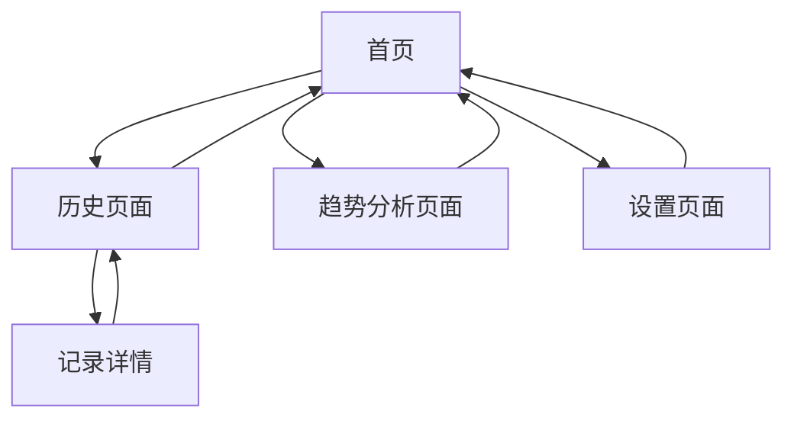

# 情绪记录疗愈 Web App 产品需求文档

## 1. 产品概述

一个专注于情绪记录和疗愈体验的 Web 应用，帮助用户记录每日心情、撰写日记，并通过数据可视化分析情绪趋势。

* 核心目标：为用户提供一个安全、舒缓的情绪记录空间，通过数据分析帮助用户更好地了解自己的情绪变化规律。

* 目标用户：关注心理健康、希望进行情绪管理的个人用户。

* 产品价值：通过科学的情绪记录和可视化分析，帮助用户建立健康的情绪管理习惯。

## 2. 核心功能

### 2.1 用户角色

本产品采用单一用户模式，无需复杂的角色区分：

| 角色   | 访问方式 | 核心权限                            |
| ---- | ---- | ------------------------------- |
| 默认用户 | 直接访问 | 可记录情绪、撰写日记、上传媒体文件、查看历史记录、分析情绪趋势 |

### 2.2 功能模块

我们的情绪记录疗愈app包含以下主要页面：

1. **首页**：情绪选择器、日记编写区、媒体上传功能
2. **历史页面**：日历视图、记录列表、详情查看
3. **趋势分析页面**：情绪折线图、词云组件、情绪占比饼图
4. **设置页面**：个人偏好设置、数据管理

### 2.3 页面详情

| 页面名称   | 模块名称   | 功能描述                                |
| ------ | ------ | ----------------------------------- |
| 首页     | 情绪选择器  | 提供开心、难过、焦虑、平静、愤怒、兴奋等情绪选项，支持点击选择当日心情 |
| 首页     | 日记编写区  | 文本输入框，支持用户撰写当日感受和想法，字数建议50-500字     |
| 首页     | 媒体上传   | 支持上传照片或录音文件，增强记录的丰富性和真实性            |
| 首页     | 快速保存   | 一键保存当日记录，包含时间戳和所有输入内容               |
| 历史页面   | 日历视图   | 月历展示，标记有记录的日期，支持点击查看具体日期的记录详情       |
| 历史页面   | 记录列表   | 按时间倒序展示所有历史记录，包含日期、情绪、日记摘要          |
| 历史页面   | 详情查看   | 展示选定日期的完整记录，包括情绪、日记全文、上传的媒体文件       |
| 历史页面   | 搜索筛选   | 支持按情绪类型、日期范围、关键词搜索历史记录              |
| 趋势分析页面 | 情绪折线图  | 展示最近30天或自定义时间段内的情绪变化趋势，Y轴为情绪积极度评分   |
| 趋势分析页面 | 词云组件   | 从所有日记中提取高频词汇生成词云，词汇大小和颜色根据出现频率变化    |
| 趋势分析页面 | 情绪占比饼图 | 统计各类情绪在选定时间段内的出现次数和占比，直观展示情绪分布      |
| 趋势分析页面 | 数据洞察   | 基于数据分析提供简单的情绪模式总结和建议                |
| 设置页面   | 个人偏好   | 设置提醒时间、主题色彩、字体大小等个性化选项              |
| 设置页面   | 数据管理   | 支持导出记录数据、清空历史数据、数据备份等功能             |

## 3. 核心流程

**主要用户操作流程：**

1. 用户进入首页，选择当前心情状态
2. 在日记编写区记录当日感受和想法
3. 可选择上传相关照片或录音文件
4. 点击保存按钮完成当日记录
5. 通过历史页面查看过往记录，可使用日历或列表模式浏览
6. 在趋势分析页面查看情绪数据可视化分析结果
7. 在设置页面调整个人偏好和管理数据

## 4. 用户界面设计

### 4.1 设计风格

* **主色调**：奶白色 (#FEFEFE)、雾紫色 (#E6E0F8)、淡蓝色 (#E3F2FD)

* **辅助色**：柔和粉色 (#F8E6E0)、薄荷绿 (#E0F8E6)、暖灰色 (#F5F5F5)

* **按钮样式**：圆角矩形，具有轻微阴影和果冻感，支持柔和的按压动效

* **字体**：优雅易读的无衬线字体，主标题18-24px，正文14-16px，辅助文字12px

* **布局风格**：卡片式设计，大量留白，柔和的分割线，顶部导航栏

* **图标风格**：线性图标配合柔和填充，情绪图标采用可爱的表情符号

* **动效**：缓动过渡效果，页面切换使用淡入淡出，按钮交互有轻微弹性效果

### 4.2 页面设计概览

| 页面名称   | 模块名称   | UI元素                                 |
| ------ | ------ | ------------------------------------ |
| 首页     | 情绪选择器  | 圆形情绪按钮网格，每个按钮包含表情图标和文字标签，选中状态有柔和光晕效果 |
| 首页     | 日记编写区  | 大面积文本输入框，圆角边框，淡紫色边框，内部有温馨的占位符文字      |
| 首页     | 媒体上传   | 虚线边框的上传区域，拖拽上传支持，上传成功后显示缩略图          |
| 历史页面   | 日历视图   | 简洁月历，有记录的日期用小圆点标记，选中日期高亮显示           |
| 历史页面   | 记录列表   | 卡片式列表，每张卡片包含日期、情绪图标、日记摘要，卡片间距适中      |
| 趋势分析页面 | 情绪折线图  | 柔和的渐变折线，网格线淡化处理，数据点用小圆圈标记            |
| 趋势分析页面 | 词云组件   | 彩色词汇云，使用主题色系，词汇大小平滑过渡，整体布局和谐         |
| 趋势分析页面 | 情绪占比饼图 | 柔和色彩的饼图，每个扇形有轻微间隔，悬停时有放大效果           |
| 设置页面   | 设置选项   | 开关按钮采用滑动样式，选项卡片化布局，图标配文字说明           |

### 4.3 响应式设计

* **设计优先级**：移动端优先，桌面端适配

* **断点设置**：手机端(<768px)、平板端(768px-1024px)、桌面端(>1024px)

* **交互优化**：支持触摸手势，按钮大小适合手指点击，滑动操作流畅自然

* **布局适应**：移动端单列布局，桌面端多列展示，图表组件自适应容器大小

